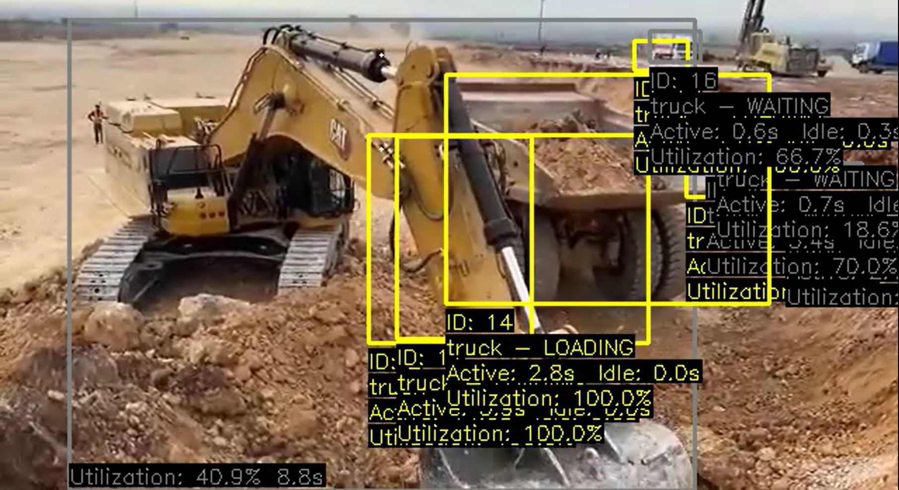
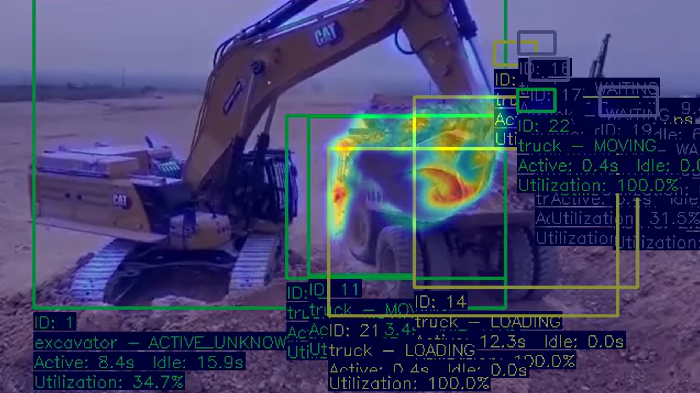

<<<<<<< HEAD
# Equipment Utilization Activity Classification

A computer vision system that detects, tracks, and classifies the real-time activity of heavy machinery (excavators and trucks) in video footage. Built with YOLOv8, ByteTrack, and dense optical flow, it ships with an interactive Streamlit dashboard for live monitoring and utilization analytics.


---

## Features

- **Object Detection & Tracking** — YOLOv8 detects excavators and trucks; ByteTrack assigns persistent IDs across frames
- **Activity Classification** — Dense optical flow on body sub-regions (bucket, arm, body, tracks) determines what each machine is doing
- **Motion Heatmap** — Accumulates motion across the video to show hotspots of activity
- **Live Dashboard** — Streamlit UI with real-time video feed, per-machine status cards, and running utilization counters
- **Batch CLI Mode** — Process a video headlessly and save annotated output MP4 files



---

## Activity Labels

| Machine | Activities |
|---|---|
| Excavator | `DIGGING`, `SWINGING_LOADING`, `DUMPING`, `WAITING`, `ACTIVE_UNKNOWN` |
| Truck | `LOADING`, `MOVING`, `WAITING` |

---

## Project Structure

```
.
├── app.py                   # Streamlit dashboard (primary UI)
├── cv_servers/
│   ├── Main.py              # CLI batch processor
│   ├── YOLOByteTracker.py   # YOLOv8 + ByteTrack wrapper
│   ├── activites.py         # Activity classification logic (Excavator, Truck)
│   ├── optical_flow.py      # Base Equipment class + optical flow utilities
│   ├── heatmap.py           # Motion heatmap accumulation and rendering
│   ├── visualization.py     # Frame annotation (bounding boxes, labels, arrows)
│   ├── db.py                # PostgreSQL integration (optional)
│   ├── kafka.py             # Kafka event streaming integration (optional)
│   └── best (2).pt          # Custom-trained YOLOv8 model weights
├── videos/
│   ├── input.mp4                       # Input video
│   ├── output_equipment_activity.mp4   # Annotated output (CLI mode)
│   └── output_motion_heatmap.mp4       # Heatmap output (CLI mode)
└── requirements.txt
```

---

## Getting Started

### Prerequisites

- Python 3.10+
- pip

### Install dependencies

```bash
pip install -r requirements.txt
```

### Run the Streamlit Dashboard

```bash
streamlit run app.py --server.port 5000
```

Open your browser at `http://localhost:5000`, then click **Start Processing** to begin live analysis.

### Run the CLI Batch Processor

```bash
cd cv_servers
python Main.py
```

Processed videos are saved to `videos/output_equipment_activity.mp4` and `videos/output_motion_heatmap.mp4`. A utilization summary is printed to the terminal when complete.

---

## How It Works

```
Video Frame
    │
    ▼
YOLOv8 Detection  ──►  Bounding boxes + class labels
    │
    ▼
ByteTrack  ──►  Persistent track IDs across frames
    │
    ▼
Optical Flow (per region)
  ├── Excavator: bucket / arm / body / tracks
  └── Truck: body
    │
    ▼
Activity Classifier  ──►  DIGGING / LOADING / MOVING / WAITING / …
    │
    ▼
┌─────────────────────────────────────┐
│  Streamlit Dashboard                │
│  ├── Annotated video feed           │
│  ├── Motion heatmap overlay         │
│  ├── Per-machine status cards       │
│  └── Utilization % progress bars   │
└─────────────────────────────────────┘
```

### Activity Classification Rules

**Excavator**

| Activity | Condition |
|---|---|
| `DIGGING` | Arm + bucket moving, body + tracks still, no truck nearby |
| `SWINGING_LOADING` | Arm + body moving, tracks still, truck nearby |
| `DUMPING` | Bucket moving, body + tracks still, truck nearby |
| `WAITING` | All regions stationary |
| `ACTIVE_UNKNOWN` | Motion detected but no rule matched |

**Truck**

| Activity | Condition |
|---|---|
| `LOADING` | Stationary, excavator nearby |
| `WAITING` | Stationary, no excavator nearby |
| `MOVING` | Body region shows motion |

---

## Dashboard

The Streamlit dashboard updates live as the video is processed:

- **Live Video Feed** — Two tabs: annotated activity view and motion heatmap overlay
- **Machine Cards** — One card per tracked machine showing:
  - ACTIVE / INACTIVE status
  - Current activity label
  - Working time, idle time, and utilization percentage
  - Color-coded utilization bar (green ≥ 70%, amber ≥ 40%, red < 40%)
- **Summary Row** — Total active vs idle machine count at a glance
- **Previous Outputs** — Playable videos from the last batch run

---

## Optional Integrations

The following modules are available but not wired into the default pipeline. They can be enabled by importing them in `cv_servers/Main.py`.

- **`db.py`** — Batch-inserts equipment events into a PostgreSQL table (`equipment_events`) using a connection pool
- **`kafka.py`** — Publishes activity events to a Kafka topic for real-time stream processing

---

## Dependencies

| Package | Purpose |
|---|---|
| `ultralytics` | YOLOv8 detection model + ByteTrack tracker |
| `opencv-python-headless` | Video I/O, optical flow, frame annotation |
| `numpy` | Numerical array operations |
| `lap` | Linear assignment solver (required by ByteTrack) |
| `streamlit` | Interactive web dashboard |
=======
# Equipment-Utilization-Activity-Classification
>>>>>>> 34086fd9d62f28d621062fbb337db45c24480e38
